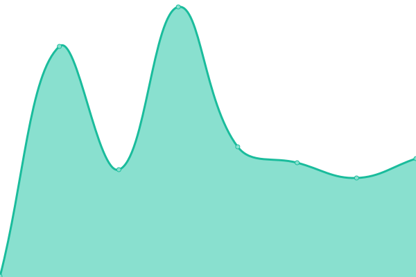
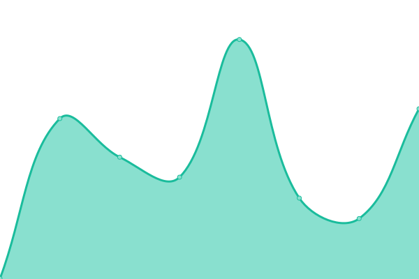

# [📈 Live Status](https://demo.upptime.js.org): <!--live status--> **🟩 All systems operational**

This repository contains the open-source uptime monitor and status page for [Upptime](https://upptime.js.org), powered by [Upptime](https://github.com/upptime/upptime).

With [Upptime](https://upptime.js.org), you can get your own unlimited and free uptime monitor and status page, powered entirely by a GitHub repository. We use [Issues](https://github.com/upptime/upptime/issues) as incident reports, [Actions](https://github.com/furrykitsune/styluscat-status/actions) as uptime monitors, and [Pages](https://demo.upptime.js.org) for the status page.

<!--start: status pages-->
<!-- This summary is generated by Upptime (https://github.com/upptime/upptime) -->
<!-- Do not edit this manually, your changes will be overwritten -->
<!-- prettier-ignore -->
| URL | Status | History | Response Time | Uptime |
| --- | ------ | ------- | ------------- | ------ |
|  [Main Site (techcat.dev)](https://techcat.dev) | 🟩 Up | [main-site-techcat-dev.yml](https://github.com/techcat-dev/techcat-site-status/commits/HEAD/history/main-site-techcat-dev.yml) | 

 185ms
     
 | 

<a href="https://status.techcat.dev/history/main-site-techcat-dev">100.00%</a>
    

|  [Old Site (styluscat.com)](https://styluscat.com) | 🟩 Up | [old-site-styluscat-com.yml](https://github.com/techcat-dev/techcat-site-status/commits/HEAD/history/old-site-styluscat-com.yml) | 

 173ms
     
 | 

<a href="https://status.techcat.dev/history/old-site-styluscat-com">100.00%</a>
    

|  [Furry Femboy Pics (furryfemboys.pics)](https://furryfemboys.pics) | 🟩 Up | [furry-femboy-pics-furryfemboys-pics.yml](https://github.com/techcat-dev/techcat-site-status/commits/HEAD/history/furry-femboy-pics-furryfemboys-pics.yml) | 

 287ms
     
 | 

<a href="https://status.techcat.dev/history/furry-femboy-pics-furryfemboys-pics">100.00%</a>
    

|  [Wii Site (isawiireallyhostingthis.lol)](https://isawiireallyhostingthis.lol) | 🟩 Up | [wii-site-isawiireallyhostingthis-lol.yml](https://github.com/techcat-dev/techcat-site-status/commits/HEAD/history/wii-site-isawiireallyhostingthis-lol.yml) | 

 282ms
     
 | 

<a href="https://status.techcat.dev/history/wii-site-isawiireallyhostingthis-lol">100.00%</a>
    

<!--end: status pages-->

[**Visit our status website →**](https://demo.upptime.js.org)

## 📄 License

- Powered by: [Upptime](https://github.com/upptime/upptime)
- Code: [MIT](./LICENSE) © [Anand Chowdhary](https://anandchowdhary.com), supported by [Pabio](https://pabio.com)
- Data in the `./history` directory: [Open Database License](https://opendatacommons.org/licenses/odbl/1-0/)
